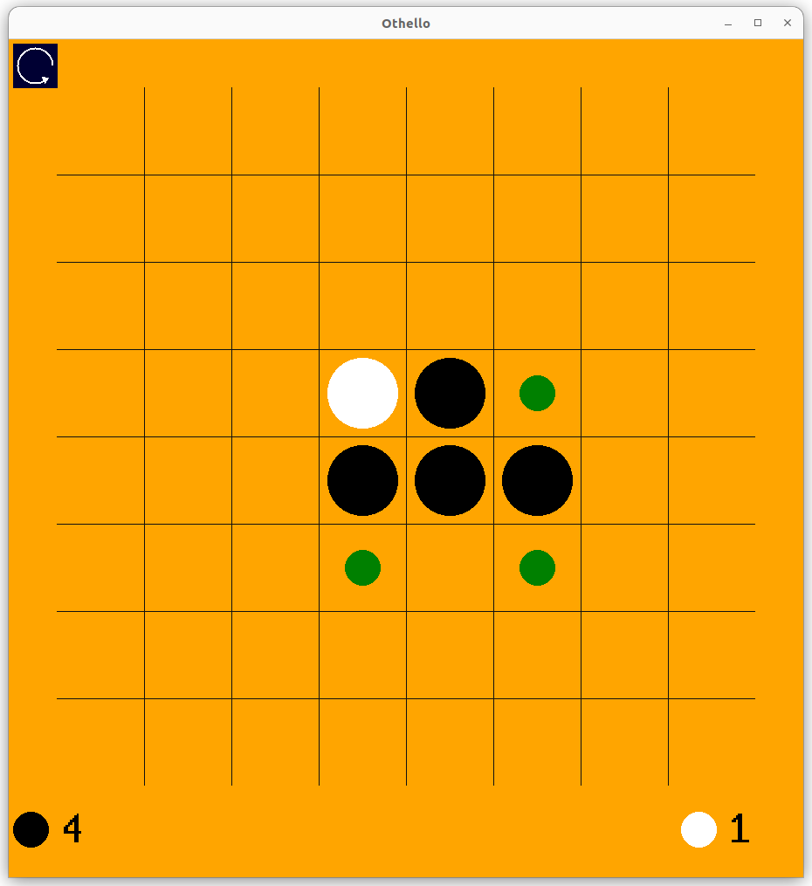

# AlphaZero for boardgame
A distributed training implementation of [AlphaZero](https://www.science.org/doi/10.1126/science.aar6404) for boardgames which support parallel self-playing and parallel matches for model comparison. The codebase is based on Surag Nar's  single-process [implementation](https://github.com/suragnair/alpha-zero-general).

## Installation
```bash
conda create -n othello python=3.10
conda activate othello
pip3 install torch torchvision yacs tqdm
```
## Demo

A pretrained model and GUI are provided for Othello.
### Download pretrained weights
```bash
cd pretrained
bash download.sh
cd ..
```
### Run GUI
Interface:
- click on <span style="color:green">green</span> dot to select move.
- press <kbd>q</kbd> to quit.
- press <kbd>r</kbd> for new game.
- click the top-right button to undo moves.

```bash 
python demo.py --config "./configs/demo.yaml"
```
<p align="center"></p>

### Custom configs
In `configs/demo.yaml`:

-  `DEMO.HUMAN_PLAYERS`: use `1` to play as the first player and `-1` for the second.

## Training
The given training config requires 8 CPUs, 32GiB RAM, and 1 GPU with at least 2GB. The training takes around 2 days.
```bash
python train.py  --config "./configs/train.yaml"
```